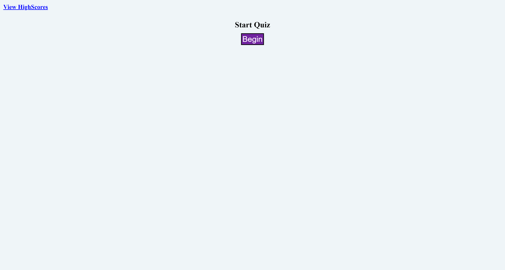

# Code Quiz Project

## Table of contents
1. [Description](#description)
2. [Visuals](#visuals)

## Description
This is a javascript based code quiz. Users start by pressing the "Start" button, then are given a question. After answer the questions, text shows showing the user if they are correct or wrong. There are four questions. After the last question, there is a section for inputing initials. Then the site goes to a highscore screen, where the highscores are sorted from top to bottom. The user can reset the highscores.
[Link to live site](https://bbelk.github.io/code-quiz-project/) 

## Visuals
